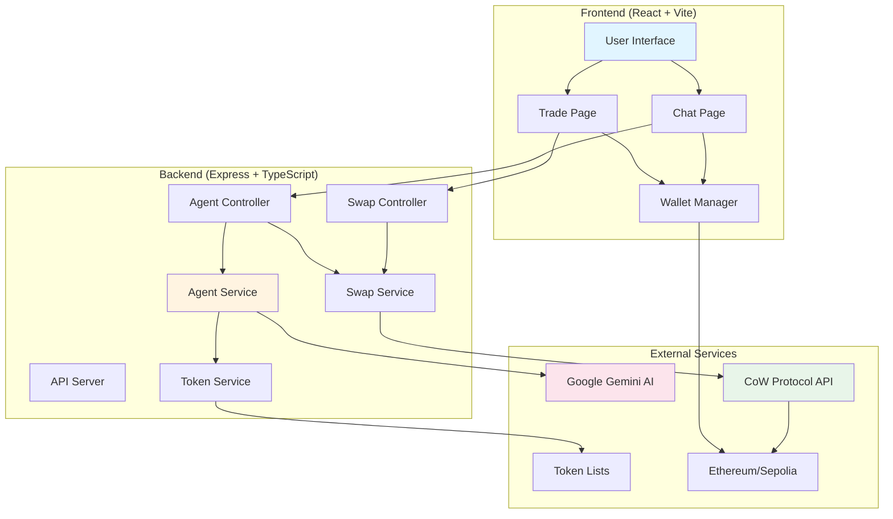
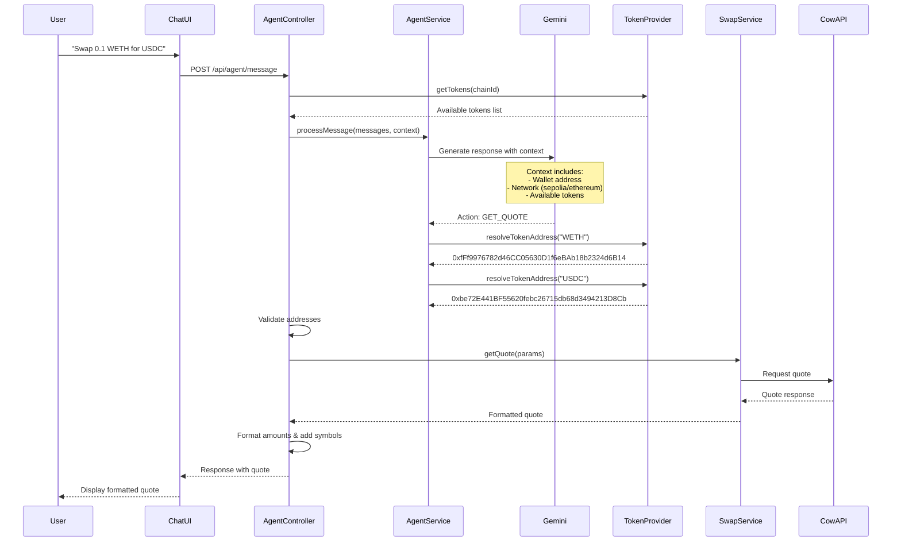
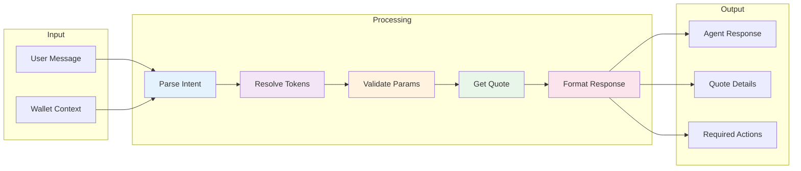

# Alpha Swap 🔄

> A next-generation decentralized exchange aggregator with AI-powered natural language trading

AlphaSwap is a modern DEX aggregator that combines the power of CoW Protocol's MEV protection with an intelligent AI agent for seamless token swaps. Built with TypeScript, React, and Google's Gemini AI, it offers both traditional swap interfaces and conversational trading experiences.

[](https://opensource.org/licenses/ISC)
[](https://www.typescriptlang.org/)
[](https://react.dev/)

## ✨ Features

### 🎯 Core Trading Features
- **Best Execution**: Aggregates liquidity from multiple sources via CoW Protocol
- **MEV Protection**: Protects against front-running and sandwich attacks
- **Gas-less Orders**: Sign messages instead of submitting transactions
- **Multi-Network Support**: Ethereum Mainnet and Sepolia Testnet
- **Dynamic Token Lists**: Extensive token support with automatic logo fetching

### 🤖 AI-Powered Chat Agent
- **Natural Language Trading**: "Swap 0.1 WETH for USDC" - just type what you want
- **Context-Aware**: Automatically uses your connected wallet and network
- **Smart Token Resolution**: Understands symbols and resolves to contract addresses
- **Balance Checking**: Ask about your token balances in plain English
- **Intelligent Validation**: Prevents invalid trades before they happen

### 🎨 User Experience
- **Modern UI**: Clean, Uniswap-inspired interface
- **Real-time Quotes**: Live pricing with formatted amounts
- **Wallet Integration**: Seamless MetaMask and WalletConnect support
- **Responsive Design**: Works on desktop and mobile

## 🏗️ Architecture

### System Overview



### Agent Workflow



### Data Flow



## 📁 Project Structure

```
alpha_swap/
├── src/                          # Backend source code
│   ├── adapters/                 # Protocol adapters
│   │   ├── interfaces/
│   │   │   └── ISwapAdapter.ts   # Swap adapter interface
│   │   └── cowSwapAdapter.ts     # CoW Protocol implementation
│   ├── config/
│   │   └── chains.ts             # Chain configurations
│   ├── controllers/
│   │   ├── agentController.ts    # AI agent request handler
│   │   ├── chainController.ts    # Chain info handler
│   │   ├── swapController.ts     # Swap request handler
│   │   └── tokenController.ts    # Token list handler
│   ├── routes/
│   │   ├── agentRoutes.ts        # /api/agent routes
│   │   ├── chainRoutes.ts        # /api/chains routes
│   │   ├── swapRoutes.ts         # /api/swap routes
│   │   └── tokenRoutes.ts        # /api/tokens routes
│   ├── services/
│   │   ├── token/
│   │   │   ├── TokenProvider.ts          # Token provider interface
│   │   │   ├── CowSwapTokenProvider.ts   # CoW token list provider
│   │   │   └── TokenService.ts           # Token service
│   │   ├── agentService.ts       # Gemini AI integration
│   │   └── swapService.ts        # Swap orchestration
│   ├── types/
│   │   └── agentTypes.ts         # Agent type definitions
│   └── server.ts                 # Express server entry point
├── web/                          # Frontend source code
│   ├── src/
│   │   ├── api/
│   │   │   ├── agentApi.ts       # Agent API client
│   │   │   ├── swapApi.ts        # Swap API client
│   │   │   └── tokenApi.ts       # Token API client
│   │   ├── components/
│   │   │   ├── ChatPage.tsx      # Chat interface
│   │   │   ├── ChatMessage.tsx   # Message display
│   │   │   ├── ChatInput.tsx     # Message input
│   │   │   ├── TradePage.tsx     # Traditional swap UI
│   │   │   ├── OrderForm.tsx     # Swap form
│   │   │   ├── TokenSelectorModal.tsx
│   │   │   └── ...
│   │   ├── hooks/
│   │   │   └── useWallet.ts      # Wallet connection hook
│   │   ├── App.tsx               # Main app component
│   │   └── main.tsx              # React entry point
│   ├── public/                   # Static assets
│   └── vite.config.ts            # Vite configuration
├── .env.example                  # Environment variables template
├── package.json                  # Root dependencies & scripts
├── tsconfig.json                 # TypeScript configuration
└── README.md                     # This file
```

## 🚀 Getting Started

### Prerequisites

- **Node.js** v16 or higher
- **npm** or **yarn**
- **MetaMask** or compatible Web3 wallet
- **Google Gemini API Key** (for chat agent)

### Installation

1. **Clone the repository**
   ```bash
   git clone <repository-url>
   cd alpha_swap
   ```

2. **Install dependencies**
   ```bash
   npm install
   cd web && npm install && cd ..
   ```

3. **Set up environment variables**
   ```bash
   cp .env.example .env
   ```
   
   Edit `.env` and add your API keys:
   ```env
   # Required for AI Chat Agent
   GEMINI_API_KEY=your_gemini_api_key_here
   
   # Optional: Custom RPC endpoints
   ETHEREUM_RPC_URL=https://eth.llamarpc.com
   SEPOLIA_RPC_URL=https://rpc.ankr.com/eth_sepolia
   
   # Server configuration
   PORT=3000
   ```

4. **Start the application**
   ```bash
   npm start
   ```
   
   This will start:
   - Backend server at `http://localhost:3000`
   - Frontend dev server at `http://localhost:5173`

### Development Mode

For backend-only development:
```bash
npm run start:server
```

For frontend-only development:
```bash
npm run start:web
```

## 🎮 Usage

### Traditional Swap Interface

1. Navigate to `http://localhost:5173/`
2. Connect your wallet
3. Select tokens and enter amount
4. Review quote and confirm swap

### AI Chat Agent

1. Navigate to `http://localhost:5173/chat`
2. Connect your wallet
3. Type natural language commands:
   - "Swap 0.1 WETH for USDC"
   - "Quote for 100 DAI to WETH on Sepolia"
   - "Check my WETH balance"
   - "Show me supported tokens"

### API Endpoints

#### Agent API
```typescript
POST /api/agent/message
{
  "messages": [
    { "role": "user", "content": "Swap 0.1 WETH for USDC" }
  ],
  "walletContext": {
    "currentAddress": "0x...",
    "currentNetwork": 11155111
  }
}
```

#### Swap API
```typescript
POST /api/swap/quote
{
  "sellToken": "0xfFf9976782d46CC05630D1f6eBAb18b2324d6B14",
  "buyToken": "0xbe72E441BF55620febc26715db68d3494213D8Cb",
  "amount": "0.1",
  "kind": "sell",
  "userAddress": "0x...",
  "chainId": 11155111
}
```

#### Token API
```typescript
GET /api/tokens?chainId=11155111
```

#### Chain API
```typescript
GET /api/chains
```

## 🔧 Configuration

### Supported Networks

| Network | Chain ID | Status |
|---------|----------|--------|
| Ethereum Mainnet | 1 | ✅ Active |
| Sepolia Testnet | 11155111 | ✅ Active |

### Environment Variables

| Variable | Description | Required | Default |
|----------|-------------|----------|---------|
| `GEMINI_API_KEY` | Google Gemini API key for chat agent | Yes | - |
| `ETHEREUM_RPC_URL` | Ethereum RPC endpoint | No | Public node |
| `SEPOLIA_RPC_URL` | Sepolia RPC endpoint | No | Public node |
| `PORT` | Backend server port | No | 3000 |

## 🧠 AI Agent Features

### Capabilities

- ✅ Natural language understanding
- ✅ Context-aware responses
- ✅ Dynamic token resolution
- ✅ Network detection
- ✅ Balance checking
- ✅ Quote generation
- ✅ Input validation
- ✅ Error handling

### Supported Commands

| Command Type | Examples |
|-------------|----------|
| Swap Requests | "Swap 0.1 WETH for USDC"<br>"I want to trade 100 DAI for WETH"<br>"Quote for 1 ETH to USDC" |
| Balance Checks | "Check my WETH balance"<br>"What's my ETH balance?"<br>"Show COW balance" |
| Information | "What tokens are supported?"<br>"Show me available tokens on Sepolia" |

### Agent Behavior

1. **Network Awareness**: Automatically uses connected network if not specified
2. **Token Resolution**: Converts symbols (WETH, USDC) to contract addresses
3. **Validation**: Checks token availability and address validity
4. **Error Handling**: Provides clear, actionable error messages
5. **Context Retention**: Remembers conversation history

## 🔐 Security

- **No Private Keys**: All signing happens in the user's wallet
- **MEV Protection**: Orders batched via CoW Protocol
- **Input Validation**: All inputs validated before processing
- **Rate Limiting**: API endpoints protected (recommended for production)
- **CORS**: Configured for security (update for production)

## 🛠️ Tech Stack

### Frontend
- **React 18** - UI framework
- **TypeScript** - Type safety
- **Vite** - Build tool & dev server
- **Ethers.js v6** - Ethereum interaction
- **CoW SDK** - Protocol integration

### Backend
- **Node.js** - Runtime
- **Express 5** - Web framework
- **TypeScript** - Type safety
- **CoW SDK** - Quote & order APIs
- **Google Generative AI** - Gemini integration

### External Services
- **CoW Protocol** - Order settlement
- **Google Gemini 2.5 Flash** - AI agent
- **CoW Token Lists** - Token metadata

## 📊 Performance

- **Quote Latency**: ~500-1000ms (CoW API dependent)
- **Agent Response**: ~1-2s (Gemini API dependent)
- **Token List Cache**: Fetched per request (consider caching)
- **Frontend Bundle**: Optimized with Vite

## 🚧 Roadmap

- [ ] Add order history tracking
- [ ] Implement persistent chat sessions
- [ ] Add more networks (Arbitrum, Base, etc.)
- [ ] Token approval management in chat
- [ ] Price alerts and notifications
- [ ] Advanced trading strategies
- [ ] Portfolio tracking
- [ ] Multi-language support

## 🤝 Contributing

Contributions are welcome! Please follow these steps:

1. Fork the repository
2. Create a feature branch (`git checkout -b feature/amazing-feature`)
3. Commit your changes (`git commit -m 'Add amazing feature'`)
4. Push to the branch (`git push origin feature/amazing-feature`)
5. Open a Pull Request

## 📝 License

This project is licensed under the ISC License.

## 🙏 Acknowledgments

- [CoW Protocol](https://cow.fi/) - For MEV-protected swaps
- [Google Gemini](https://ai.google.dev/) - For AI capabilities
- [Uniswap](https://uniswap.org/) - For UI/UX inspiration

## 📧 Support

For questions or issues:
- Open an issue on GitHub
- Check existing documentation
- Review the [Chat Agent Setup Guide](./CHAT_AGENT_SETUP.md)

---

Built with ❤️ using TypeScript, React, and AI
